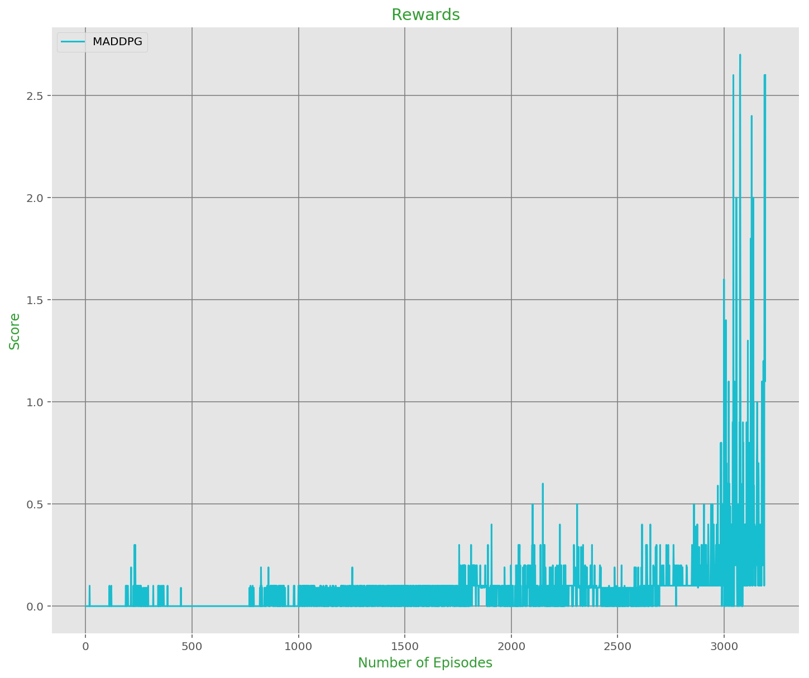

# Deep Q-Learning Network (DQN) Agent Continuous Control Project

### Introduction


[image1]: https://user-images.githubusercontent.com/10624937/43851024-320ba930-9aff-11e8-8493-ee547c6af349.gif "Trained Agent"
[image2]: https://user-images.githubusercontent.com/10624937/43851646-d899bf20-9b00-11e8-858c-29b5c2c94ccc.png "Crawler"


For this project, the [Reacher](https://github.com/Unity-Technologies/ml-agents/blob/master/docs/Learning-Environment-Examples.md#reacher) environment was used.

![Trained Agent][image1]

## Environment Details

In this environment, a double-jointed arm can move to target locations. A reward of +0.1 is provided for each step that the agent's hand is in the goal location. Thus, the goal of your agent is to maintain its position at the target location for as many time steps as possible.

The observation space consists of 33 variables corresponding to position, rotation, velocity, and angular velocities of the arm. Each action is a vector with four numbers, corresponding to torque applicable to two joints. Every entry in the action vector should be a number between -1 and 1.

The task is episodic, and in order to solve the environment,  your agent must get an average score of +30 over 100 consecutive episodes.

This project was completed using the Udacity Workspace with GPU processing for a single agent. [Unity ML-agents](https://github.com/Unity-Technologies/ml-agents) is used at the baseline for creating the environment. There is a second version which contains 20 identical agents, each with its own copy of the environment. The second version is useful for algorithms like [PPO](https://arxiv.org/pdf/1707.06347.pdf), [A3C](https://arxiv.org/pdf/1602.01783.pdf), and [D4PG](https://openreview.net/pdf?id=SyZipzbCb) that use multiple (non-interacting, parallel) copies of the same agent to distribute the task of gathering experience and will be explored at a later time.


The task is episodic, and **in order to solve the environment, agent must get an average score of +30 over 100 consecutive episodes.** This Report.md describes an off-policy Deep Deterministic Policy Gradient (DDPG) implementation.


## Agent Implementation

### Mulit-Agent Deep Deterministic Policy Gradient (MADDDPG)

[Multi-Agent Deep Deterministic Policy Gradient (MADDPG)](https://arxiv.org/abs/1706.02275) builds upon the [Deep Deterministic Policy Gradient (DDPG)](https://arxiv.org/abs/1509.02971) algorithm for environments by simultaneoulsy learning a policy and a Q-function via the Bellman equation. The content below is referenced from [OpenAI](https://spinningup.openai.com/en/latest/algorithms/ddpg.html).


More concretely, consider a game with N agents with policies parameterized by θ = {θ<sub>1</sub>, ..., θ<sub>N</sub> }, and let π = {π<sub>1</sub>, ..., π<sub>N</sub> } be the set of all agent policies. Then we can write the gradient of the expected return for agent *i, J(θ<sub>i</sub>) = E[Ri]* as:


Here Q<sup>i</sup><sub>π</sub>(x, a1, ..., aN ) is a centralized action-value function that takes as input the actions of all
agents, a1, . . . , aN , in addition to some state information x, and outputs the Q-value for agent i. In
the simplest case, x could consist of the observations of all agents, x = (o1, ..., oN ), however we
could also include additional state information if available. Since each Qπ
i
is learned separately,
agents can have arbitrary reward structures, including conflicting rewards in a competitive setting.
We can extend the above idea to work with deterministic policies. If we now consider N continuous
policies µθi w.r.t. parameters θi (abbreviated as µi), the gradient can be written as:
∇θiJ(µi) = Ex,a∼D[∇θiµi(ai
|oi)∇aiQ
µ
i
(x, a1, ..., aN )|ai=µi(oi)
],

This approach is closely connected to Q-learning, and is motivated the same way: if you know the optimal action-value function :math:`Q^*(s,a)`, then in any given state, the optimal action :math:`a^*(s)` can be found by solving

.. math::

    a^*(s) = \arg \max_a Q^*(s,a).

DDPG interleaves learning an approximator to :math:`Q^*(s,a)` with learning an approximator to :math:`a^*(s)`, and it does so in a way which is specifically adapted for environments with continuous action spaces by relating to how  the max over actions in :math:`\max_a Q^*(s,a)` are computed.

As the action space is continuous, the function :math:`Q^*(s,a)` is presumed to be differentiable with respect to the action argument. This allows for an efficient, gradient-based learning rule for a policy :math:`\mu(s)` which exploits that fact. Afterward, and approximation with :math:`\max_a Q(s,a) \approx Q(s,\mu(s))` can be derived.

#### Replay Buffers.

All standard algorithms for training a deep neural network to approximate :math:`Q^*(s,a)` make use of an experience replay buffer. This is the set :math:`{\mathcal D}` of previous experiences. In order for the algorithm to have stable behavior, the replay buffer should be large enough to contain a wide range of experiences, but it may not always be good to keep everything. If you only use the very-most recent data, you will overfit to that and things will break; if you use too much experience, you may slow down your learning. This may take some tuning to get right.

#### Target Networks

Q-learning algorithms make use of **target networks**. The term

.. math::

    r + \gamma (1 - d) \max_{a'} Q_{\phi}(s',a')

is called the **target**, because when we minimize the MSBE loss, we are trying to make the Q-function be more like this target. Problematically, the target depends on the same parameters we are trying to train: :math:`\phi`. This makes MSBE minimization unstable. The solution is to use a set of parameters which comes close to :math:`\phi`, but with a time delay---that is to say, a second network, called the target network, which lags the first. The parameters of the target network are denoted :math:`\phi_{\text{targ}}`.

In DQN-based algorithms, the target network is just copied over from the main network every some-fixed-number of steps. In DDPG-style algorithms, the target network is updated once per main network update by polyak averaging:

.. math::

    \phi_{\text{targ}} \leftarrow \rho \phi_{\text{targ}} + (1 - \rho) \phi,

where :math:`\rho` is a hyperparameter between 0 and 1 (usually close to 1). (This hyperparameter is called ``polyak`` in our code).

#### DDPG Specific

Computing the maximum over actions in the target is a challenge in continuous action spaces. DDPG deals with this by using a **target policy network** to compute an action which approximately maximizes :math:`Q_{\phi_{\text{targ}}}`. The target policy network is found the same way as the target Q-function: by polyak averaging the policy parameters over the course of training.

Putting it all together, Q-learning in DDPG is performed by minimizing the following MSBE loss with stochastic gradient descent:

.. math::

    L(\phi, {\mathcal D}) = \underset{(s,a,r,s',d) \sim {\mathcal D}}{{\mathrm E}}\left[
        \Bigg( Q_{\phi}(s,a) - \left(r + \gamma (1 - d) Q_{\phi_{\text{targ}}}(s', \mu_{\theta_{\text{targ}}}(s')) \right) \Bigg)^2
        \right],

where :math:`\mu_{\theta_{\text{targ}}}` is the target policy.


#### The Policy Learning Side of DDPG

Policy learning in DDPG is fairly simple. We want to learn a deterministic policy :math:`\mu_{\theta}(s)` which gives the action that maximizes :math:`Q_{\phi}(s,a)`. Because the action space is continuous, and we assume the Q-function is differentiable with respect to action, we can just perform gradient ascent (with respect to policy parameters only) to solve

.. math::

    \max_{\theta} \underset{s \sim {\mathcal D}}{{\mathrm E}}\left[ Q_{\phi}(s, \mu_{\theta}(s)) \right].

Note that the Q-function parameters are treated as constants here.

Below, the pseudocode is described:

#### Pseudocode
----------

.. math::
    :nowrap:

    \begin{algorithm}[H]
        \caption{Deep Deterministic Policy Gradient}
        \label{alg1}
    \begin{algorithmic}[1]
        \STATE Input: initial policy parameters $\theta$, Q-function parameters $\phi$, empty replay buffer $\mathcal{D}$
        \STATE Set target parameters equal to main parameters $\theta_{\text{targ}} \leftarrow \theta$, $\phi_{\text{targ}} \leftarrow \phi$
        \REPEAT
            \STATE Observe state $s$ and select action $a = \text{clip}(\mu_{\theta}(s) + \epsilon, a_{Low}, a_{High})$, where $\epsilon \sim \mathcal{N}$
            \STATE Execute $a$ in the environment
            \STATE Observe next state $s'$, reward $r$, and done signal $d$ to indicate whether $s'$ is terminal
            \STATE Store $(s,a,r,s',d)$ in replay buffer $\mathcal{D}$
            \STATE If $s'$ is terminal, reset environment state.
            \IF{it's time to update}
                \FOR{however many updates}
                    \STATE Randomly sample a batch of transitions, $B = \{ (s,a,r,s',d) \}$ from $\mathcal{D}$
                    \STATE Compute targets
                    \begin{equation*}
                        y(r,s',d) = r + \gamma (1-d) Q_{\phi_{\text{targ}}}(s', \mu_{\theta_{\text{targ}}}(s'))
                    \end{equation*}
                    \STATE Update Q-function by one step of gradient descent using
                    \begin{equation*}
                        \nabla_{\phi} \frac{1}{|B|}\sum_{(s,a,r,s',d) \in B} \left( Q_{\phi}(s,a) - y(r,s',d) \right)^2
                    \end{equation*}
                    \STATE Update policy by one step of gradient ascent using
                    \begin{equation*}
                        \nabla_{\theta} \frac{1}{|B|}\sum_{s \in B}Q_{\phi}(s, \mu_{\theta}(s))
                    \end{equation*}
                    \STATE Update target networks with
                    \begin{align*}
                        \phi_{\text{targ}} &\leftarrow \rho \phi_{\text{targ}} + (1-\rho) \phi \\
                        \theta_{\text{targ}} &\leftarrow \rho \theta_{\text{targ}} + (1-\rho) \theta
                    \end{align*}
                \ENDFOR
            \ENDIF
        \UNTIL{convergence}
    \end{algorithmic}
    \end{algorithm}


## Model
The next two entries visualize the flow diagrams for the Network. This work builds upon implementations from the first DRLND project [Navigation](https://github.com/Ohara124c41/DRLND-Navigation/blob/master/Report.md) and the second DRLND project [Continuous Control](https://github.com/Ohara124c41/DRL-Continuous_Control/blob/master/Report.md).


#### Actor
Below, the flow diagram demonstrates how the Actor network is setup.

```py
model = Actor(state_size, action_size, 42)
model.eval()
x = Variable(torch.randn(1,state_size))
y = model(x)

make_dot(y, params=dict(list(model.named_parameters())))
```


#### Critic
Below, the flow diagram demonstrates how the Critic network is setup.

```py
model = Critic(state_size, action_size, 42)
model.eval()
x = Variable(torch.randn(1,state_size))
z = Variable(torch.randn(1,action_size))
y = model(x, z)

make_dot(y, params=dict(list(model.named_parameters())))
```


### Code Implementation


**NOTE:** Code will run in GPU if CUDA is available, otherwise it will run in CPU

Code is structured in different modules. The most relevant features will be explained next:

1. **model.py:** It contains the main execution thread of the program. This file is where the main algorithm is coded (see *algorithm* above). PyTorch is utilized for training the agent in the environment. The agent has an Actor and Critic network.
2. **ddpg_agent.py:** The model script contains  the **DDPG agent**, a **Replay Buffer memory**, and the **Q-Targets** feature. A `learn()` method uses batches to handle the value parameters and update the policy.
3. **Continuous_Control.ipynb:** The Navigation Jupyter Notebook provides an environment to run the *Tennis* game, import dependencies, train the DDPG, visualize via Unity, and plot the results. The hyperparameters can be adjusted within the Notebook.


#### PyTorch Specifics

Saved Model Contents: PyTorch Version
-------------------------------------

The PyTorch saved model can be loaded with ``ac = torch.load('path/to/model.pt')``, yielding an actor-critic object (``ac``) that has the properties described in the docstring for ``ddpg_pytorch``.

You can get actions from this model with:


```py
actions = ac.act(torch.as_tensor(obs, dtype=torch.float32))
```


### DDPG Hyperparameters

The DDPG agent uses the following parameters values (defined in parameters.py)

```
SEED = 10                          # Random seed
NB_EPISODES = 10000                # Max nb of episodes
NB_STEPS = 1000                    # Max nb of steps per episodes
UPDATE_EVERY_NB_EPISODE = 4        # Nb of episodes between learning process
MULTIPLE_LEARN_PER_UPDATE = 3      # Nb of multiple learning process performed in a row

BUFFER_SIZE = int(1e5)             # Replay buffer size
BATCH_SIZE = 256                   # Batch size #128
ACTOR_FC1_UNITS = 512   	       # Number of units for L1 in the actor model #256
ACTOR_FC2_UNITS = 256         	 # Number of units for L2 in the actor model #128
CRITIC_FCS1_UNITS = 512        	# Number of units for L1 in the critic model #256
CRITIC_FC2_UNITS = 256         	# Number of units for L2 in the critic model #128
NON_LIN = F.relu      			 # Non linearity operator used in the model #F.leaky_relu
LR_ACTOR = 1e-4                    # Learning rate of the actor #1e-4
LR_CRITIC = 5e-3             	  # Learning rate of the critic #1e-3
WEIGHT_DECAY = 0            	   # L2 weight decay #0.0001

GAMMA = 0.995                      # Discount factor #0.99
TAU = 1e-3                         # For soft update of target parameters
CLIP_CRITIC_GRADIENT = False       # Clip gradient during Critic optimization

ADD_OU_NOISE = True     		   # Toggle Ornstein-Uhlenbeck noisy relaxation process
THETA = 0.15            		   # k/gamma -> spring constant/friction coefficient [Ornstein-Uhlenbeck]
MU = 0.                 		   # x_0 -> spring length at rest [Ornstein-Uhlenbeck]
SIGMA = 0.2             		   # root(2k_B*T/gamma) -> Stokes-Einstein for effective diffision [Ornstein-Uhlenbeck]
NOISE = 1.0                        # Initial Noise Amplitude
NOISE_REDUCTION = 0.995 	       # Noise amplitude decay ratio
```

### Results

With the afformentioned setup, the agent was able to successfully meet the functional specifications in 500 episodes with an average score of 33.31 (see below):
```py
Episode 100	 Average Score: 0.00 (nb of total steps=1466     noise=0.0006)
Episode 200	 Average Score: 0.01 (nb of total steps=3066     noise=0.0000)
Episode 300	 Average Score: 0.03 (nb of total steps=5204     noise=0.0000)
Episode 400	 Average Score: 0.01 (nb of total steps=6840     noise=0.0000)
Episode 500	 Average Score: 0.00 (nb of total steps=8291     noise=0.0000)
Episode 600	 Average Score: 0.00 (nb of total steps=9711     noise=0.0000)
Episode 700	 Average Score: 0.00 (nb of total steps=11131    noise=0.0000)
Episode 800	 Average Score: 0.01 (nb of total steps=12726    noise=0.0000)
Episode 900	 Average Score: 0.05 (nb of total steps=15057    noise=0.0000)
Episode 1000	Average Score: 0.02 (nb of total steps=17013    noise=0.0000)
Episode 1100	Average Score: 0.06 (nb of total steps=19768    noise=0.0000)
Episode 1200	Average Score: 0.05 (nb of total steps=22160    noise=0.0000)
Episode 1300	Average Score: 0.05 (nb of total steps=24842    noise=0.0000)
Episode 1400	Average Score: 0.05 (nb of total steps=27546    noise=0.0000)
Episode 1500	Average Score: 0.05 (nb of total steps=30057    noise=0.0000)
Episode 1600	Average Score: 0.05 (nb of total steps=32885    noise=0.0000)
Episode 1700	Average Score: 0.05 (nb of total steps=35902    noise=0.0000)
Episode 1800	Average Score: 0.06 (nb of total steps=39120    noise=0.0000)
Episode 1900	Average Score: 0.10 (nb of total steps=43527    noise=0.0000)
Episode 2000	Average Score: 0.06 (nb of total steps=46890    noise=0.0000)
Episode 2100	Average Score: 0.08 (nb of total steps=50792    noise=0.0000)
Episode 2200	Average Score: 0.07 (nb of total steps=54382    noise=0.0000)
Episode 2300	Average Score: 0.08 (nb of total steps=58002    noise=0.0000)
Episode 2400	Average Score: 0.11 (nb of total steps=62226    noise=0.0000)
Episode 2500	Average Score: 0.06 (nb of total steps=64770    noise=0.0000)
Episode 2600	Average Score: 0.05 (nb of total steps=67201    noise=0.0000)
Episode 2700	Average Score: 0.09 (nb of total steps=71145    noise=0.0000)
Episode 2800	Average Score: 0.12 (nb of total steps=75897    noise=0.0000)
Episode 2900	Average Score: 0.13 (nb of total steps=81294    noise=0.0000)
Episode 3000	Average Score: 0.22 (nb of total steps=89657    noise=0.0000)
Episode 3100	Average Score: 0.41 (nb of total steps=105475   noise=0.0000)
Environment solved in 3193 episodes with an Average Score of 0.50 2.60
```





### Future Work

This section contains two additional algorithms that would vastly improve over the current implementation, namely TRPO and TD3. Such algorithms have been developed to improve over DQNs and DDPGs.

- [Trust Region Policy Optimization (TRPO)](https://arxiv.org/abs/1502.05477):
> We describe an iterative procedure for optimizing policies, with guaranteed monotonic improvement. By making several approximations to the theoretically-justified procedure, we develop a practical algorithm, called Trust Region Policy Optimization (TRPO). This algorithm is similar to natural policy gradient methods and is effective for optimizing large nonlinear policies such as neural networks. Our experiments demonstrate its robust performance on a wide variety of tasks: learning simulated robotic swimming, hopping, and walking gaits; and playing Atari games using images of the screen as input. Despite its approximations that deviate from the theory, TRPO tends to give monotonic improvement, with little tuning of hyperparameters.


- [Twin-Delay DDPG (TD3)](https://arxiv.org/pdf/1802.09477.pdf)
> Twin Delayed Deep Deterministic policy gradient algorithm (TD3), an actor-critic algorithm which considers the interplay between function approximation error in both policy and value updates. We evaluate our algorithm on seven continuous control domains from OpenAI gym (Brockman et al., 2016), where we outperform the state of the art by a wide margin. TD3 greatly improves both the learning speed and performance of DDPG in a number of challenging tasks in the continuous control setting.  Our algorithm exceeds the performance of numerous state of the art algorithms. As our modifications are simple to implement, they can be easily added to any other actor-critic algorithm.


## Additional References
_[1] [High-Dimensional Continuous Control Using Generalized Advantage Estimation](https://arxiv.org/abs/1506.02438)_

_[2] [CONTINUOUS CONTROL WITH DEEP REINFORCEMENT LEARNING](https://arxiv.org/pdf/1509.02971.pdf)._
